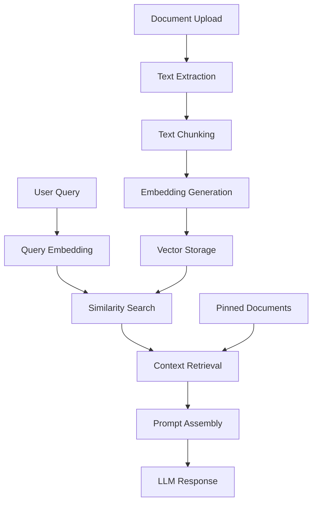

# RAG (Retrieval-Augmented Generation) Implementation in AnythingLLM

This document explains how Retrieval-Augmented Generation (RAG) is implemented in AnythingLLM, providing insights into the architecture, components, and customization options.

## Table of Contents

1. [Overview](#overview)
2. [RAG Architecture](#rag-architecture)
3. [Storage Architecture](#storage-architecture)
4. [Multi-User & Access Control](#multi-user--access-control)
5. [Document Processing Pipeline](#document-processing-pipeline)
6. [Vector Database Integration](#vector-database-integration)
7. [Embedding Engines](#embedding-engines)
8. [Chat Flow and Context Retrieval](#chat-flow-and-context-retrieval)
9. [Document Synchronization & Re-uploads](#document-synchronization--re-uploads)
10. [Memory Management](#memory-management)
11. [Customization Guide](#customization-guide)
12. [Performance Optimization](#performance-optimization)
13. [Troubleshooting](#troubleshooting)

## Overview

AnythingLLM implements a comprehensive RAG system that combines document ingestion, vectorization, similarity search, and response generation. The system supports multiple vector databases, embedding engines, and LLM providers, making it highly flexible and scalable.

### Key Components

- **Document Manager**: Handles file uploads, text extraction, and chunking
- **Embedding Engines**: Convert text chunks into vector representations
- **Vector Databases**: Store and retrieve document embeddings
- **LLM Providers**: Generate responses using retrieved context
- **Chat Handler**: Orchestrates the RAG pipeline during conversations

## RAG Architecture



### Core Workflow

1. **Indexing Phase**:
   - Documents are uploaded and processed
   - Text is extracted and split into chunks
   - Chunks are embedded using selected embedding engine
   - Vectors are stored in the chosen vector database

2. **Retrieval Phase**:
   - User queries are embedded using the same embedding engine
   - Similarity search finds relevant document chunks within workspace namespace
   - Context is assembled from retrieved chunks and pinned documents
   - LLM generates response using the assembled context

## Storage Architecture

### File System Structure

AnythingLLM uses a layered storage approach with clear separation of concerns:

```
storage/
├── documents/           # Original document files (JSON format)
│   └── custom-documents/
│       └── filename.pdf-uuid.json
├── vector-cache/        # Cached embedding vectors
│   └── uuid-based-filename.json
├── lancedb/            # LanceDB vector database files (default)
├── models/             # Downloaded embedding models
│   └── Xenova/
│       └── all-MiniLM-L6-v2/
├── anythingllm.db      # SQLite database (metadata)
└── tmp/                # Temporary processing files
```

### Storage Locations by Environment

**Development Environment:**
- Base path: `./storage/` (relative to server directory)
- Vector cache: `./storage/vector-cache/`
- Documents: `./storage/documents/`
- LanceDB: `./storage/lancedb/`

**Production Environment:**
- Base path: `process.env.STORAGE_DIR` (configurable)
- All subdirectories follow the same structure

### Vector Storage Strategy

**Local Vector Databases (LanceDB):**
```javascript
const uri = `${process.env.STORAGE_DIR || "./storage/"}/lancedb`;
// Creates namespace-specific tables: workspace-slug.lance
```

**Cloud Vector Databases:**
- Vectors stored in external services (Pinecone, Weaviate, etc.)
- Local cache still maintained for performance

### Database Schema

**Core Tables:**
```sql
-- Document metadata and workspace associations
workspace_documents (
  id, docId, filename, docpath, workspaceId, 
  metadata, pinned, watched, createdAt, lastUpdatedAt
)

-- Links between documents and vector IDs
document_vectors (
  id, docId, vectorId
)

-- Workspace access control
workspace_users (
  id, user_id, workspace_id
)

-- Chat history (user-specific)
workspace_chats (
  id, workspaceId, prompt, response, user_id, 
  thread_id, include, createdAt
)
```

## Multi-User & Access Control

### Workspace Isolation

AnythingLLM implements strict workspace-based isolation:

```javascript
// Each workspace gets its own vector namespace
namespace = workspace.slug;  // e.g., "engineering-docs", "marketing-team"

// Vector searches are always scoped to workspace
await VectorDb.performSimilaritySearch({
  namespace: workspace.slug,  // Workspace isolation
  input: userQuery,
  // Users can only access their workspace's vectors
});
```

### Access Control Model

**Workspace Membership:**
```javascript
// Users are associated with workspaces via workspace_users table
const userWorkspaces = await WorkspaceUser.where({ user_id: userId });

// Multi-user workspace access
const sharedWorkspace = await Workspace.get({ slug: "team-knowledge" });
// All team members can access the same embedded documents
```

**Permission Levels:**
- **Workspace Access**: Users can only see workspaces they're members of
- **Document Access**: All workspace members share the same document embeddings
- **Chat Privacy**: Individual chat history remains user-specific
- **Administrative Control**: Workspace admins control membership

### Shared Knowledge Base

In multi-user environments:

**Shared Components:**
- **Document Embeddings**: All workspace members benefit from any uploaded document
- **Vector Database**: Same namespace accessible to all workspace users
- **Pinned Documents**: Workspace-wide pinning affects all users

**Private Components:**
- **Chat History**: Individual conversation history per user
- **User Preferences**: Personal settings and configurations
- **API Sessions**: Separate API access per user

### Security Model

```javascript
// Workspace isolation prevents cross-contamination
const allowedWorkspaces = await user.getWorkspaces();
if (!allowedWorkspaces.includes(requestedWorkspace)) {
  throw new Error("Access denied to workspace");
}

// Vector searches cannot leak between workspaces
const results = await vectorDb.search({
  namespace: workspace.slug,  // Always scoped to user's workspace
  query: userInput
});
```

## Document Processing Pipeline

### DocumentManager (`utils/DocumentManager/index.js`)

The DocumentManager handles document lifecycle and retrieval:

```javascript
class DocumentManager {
  constructor({ workspace = null, maxTokens = null }) {
    this.workspace = workspace;
    this.maxTokens = maxTokens || Number.POSITIVE_INFINITY;
  }

  async pinnedDocs() {
    // Retrieves pinned documents for workspace
    // Enforces token limits to prevent context overflow
  }
}
```

### Document Model (`models/documents.js`)

Manages document metadata and vector operations:

```javascript
const Document = {
  addDocuments: async function (workspace, additions = [], userId = null) {
    // 1. Processes document files
    // 2. Generates embeddings via vector database
    // 3. Stores document metadata in database
    // 4. Handles error cases and telemetry
  },

  removeDocuments: async function (workspace, removals = [], userId = null) {
    // 1. Removes vectors from vector database
    // 2. Cleans up document metadata
    // 3. Logs removal events
  }
}
```

### Text Processing

Documents undergo several processing steps:

1. **Text Extraction**: PDF, DOCX, and other formats are converted to plain text
2. **Chunking**: Text is split into manageable chunks with configurable size and overlap
3. **Metadata Preservation**: Source information, titles, and other metadata are maintained
4. **Token Counting**: Estimates are made for context window management

## Vector Database Integration

AnythingLLM supports multiple vector databases through a unified interface:

### Supported Vector Databases

- **LanceDB** (Default): File-based vector database
- **Pinecone**: Cloud-hosted vector database
- **Chroma**: Open-source vector database
- **Qdrant**: Vector similarity search engine
- **Weaviate**: Cloud-native vector database
- **Milvus**: Scalable vector database
- **PostgreSQL with pgvector**: SQL database with vector extension

### LanceDB Implementation (`utils/vectorDbProviders/lance/index.js`)

```javascript
const LanceDb = {
  // Core similarity search with optional reranking
  performSimilaritySearch: async function ({
    namespace,
    input,
    LLMConnector,
    similarityThreshold = 0.25,
    topN = 4,
    filterIdentifiers = [],
    rerank = false,
  }) {
    // 1. Convert query to vector using LLMConnector
    // 2. Perform vector similarity search
    // 3. Apply similarity threshold filtering
    // 4. Optional reranking for improved relevance
    // 5. Return formatted results
  },

  addDocumentToNamespace: async function (namespace, documentData, fullFilePath) {
    // 1. Check for cached embeddings
    // 2. Split text into chunks if not cached
    // 3. Generate embeddings for chunks
    // 4. Store vectors with metadata
    // 5. Cache results for future use
  }
}
```

### Vector Search Features

- **Similarity Thresholds**: Configurable relevance filtering
- **Reranking**: Optional secondary ranking for improved results
- **Namespace Isolation**: Workspace-specific vector storage
- **Metadata Filtering**: Source-based filtering (e.g., excluding pinned documents)
- **Batch Operations**: Efficient bulk vector operations

## Embedding Engines

### Native Embedder (`utils/EmbeddingEngines/native/index.js`)

Local embedding using Transformers.js:

```javascript
class NativeEmbedder {
  static defaultModel = "Xenova/all-MiniLM-L6-v2";
  
  async embedChunks(textChunks = []) {
    // 1. Process chunks in batches to manage memory
    // 2. Use local transformer models
    // 3. Apply model-specific prefixes
    // 4. Return normalized embeddings
  }

  async embedTextInput(textInput) {
    // Embed single query with query prefix if required
  }
}
```

### Supported Embedding Providers

- **Native/Local**: Uses Transformers.js for local embedding
- **OpenAI**: text-embedding-ada-002 and newer models
- **Azure OpenAI**: Enterprise OpenAI embedding models
- **Cohere**: Multilingual embedding models
- **Voyage AI**: Specialized embedding models
- **Ollama**: Local LLM embedding capabilities
- **Generic OpenAI**: Compatible with OpenAI-format APIs

### Model Selection Considerations

- **Performance vs. Quality**: Smaller models are faster but may be less accurate
- **Language Support**: Some models support multiple languages
- **Dimension Size**: Higher dimensions may provide better accuracy
- **Context Length**: Maximum input length varies by model

## Chat Flow and Context Retrieval

### Stream Chat Handler (`utils/chats/stream.js`)

The main RAG orchestration happens in the stream chat handler:

```javascript
async function streamChatWithWorkspace(response, workspace, message, chatMode, user, thread) {
  // 1. Process user message and check for commands
  // 2. Determine if workspace has embeddings
  // 3. Handle query mode restrictions
  // 4. Retrieve recent chat history
  // 5. Collect pinned documents with token limits
  // 6. Perform vector similarity search
  // 7. Assemble context from all sources
  // 8. Compress prompts to fit model limits
  // 9. Generate streaming or standard response
  // 10. Save chat history with metadata
}
```

### Context Assembly Process

1. **Pinned Documents**: High-priority documents manually selected by users
2. **Vector Search**: Similarity-based retrieval from embeddings
3. **Chat History**: Recent conversation context for continuity
4. **Source Filtering**: Prevent duplicate information from pinned and searched documents
5. **Token Management**: Ensure context fits within model limits

### Chat Modes

- **Chat Mode**: Uses RAG when available, falls back to general knowledge
- **Query Mode**: Strictly requires retrieved context, refuses to answer without relevant documents

## Document Synchronization & Re-uploads

### Automatic Re-upload Detection

AnythingLLM automatically handles document re-uploads and updates:

```javascript
// Cache key generation for duplicate detection
const cacheKey = uuidv5(filename, uuidv5.URL);  // Consistent UUID for same file
const cacheFile = path.resolve(vectorCachePath, `${cacheKey}.json`);

// Re-upload detection in addDocumentToNamespace
const cacheResult = await cachedVectorInformation(fullFilePath);
if (cacheResult.exists) {
  console.log("Using cached embeddings - skipping re-embedding");
  // Load cached vectors instead of re-computing
  return { vectorized: true, error: null };
}
```

### Cache Management Strategy

**Vector Cache Structure:**
- **Location**: `storage/vector-cache/`
- **Naming**: UUID v5 based on filename ensures consistency
- **Content**: Pre-computed embedding vectors with metadata
- **Invalidation**: File modification time comparison

**Cache Benefits:**
```javascript
// Large documents cached to avoid expensive re-computation
async function cachedVectorInformation(filename, checkOnly = false) {
  const digest = uuidv5(filename, uuidv5.URL);
  const cacheFile = path.resolve(vectorCachePath, `${digest}.json`);
  
  if (fs.existsSync(cacheFile)) {
    // Return cached embeddings instantly
    return { exists: true, chunks: JSON.parse(rawData) };
  }
  
  // No cache - will need to embed
  return { exists: false, chunks: [] };
}
```

### Document Synchronization Features

**Watched Documents:**
```javascript
// Enable automatic synchronization
await Document.update(documentId, { watched: true });

// Background job monitors file changes
// Re-embeds automatically when source files change
```

**Manual Re-upload Handling:**
1. **Detection**: System checks cache before embedding
2. **Graceful Update**: Old vectors removed, new ones added
3. **Zero Downtime**: Workspace remains accessible during updates
4. **Consistency**: All workspace users see updated content immediately

**Synchronization Process:**
```javascript
// Document update workflow
async function updateDocument(workspace, docPath) {
  // 1. Remove old vectors from vector database
  await VectorDb.deleteDocumentFromNamespace(workspace.slug, oldDocId);
  
  // 2. Remove old cache
  await purgeVectorCache(docPath);
  
  // 3. Re-embed with new content
  const { vectorized } = await VectorDb.addDocumentToNamespace(
    workspace.slug, 
    documentData, 
    docPath
  );
  
  // 4. Update database metadata
  await Document.update(documentId, { lastUpdatedAt: new Date() });
}
```

### Conflict Resolution

**Multiple Users, Same Document:**
- **First Upload Wins**: First user to upload creates the embeddings
- **Shared Cache**: Subsequent uploads use cached embeddings
- **Consistent View**: All users see the same embedded content

**Version Management:**
- **No Automatic Versioning**: Latest upload overwrites previous version
- **Manual Backup**: Users must manage document versions externally
- **Timestamp Tracking**: `lastUpdatedAt` field tracks last modification

## Memory Management

### Multi-Layered Memory Architecture

AnythingLLM implements sophisticated memory management across multiple levels:

```
┌─────────────────────────────────────────────────┐
│                 Memory Layers                    │
├─────────────────────────────────────────────────┤
│ 1. Runtime Memory (Temporary Processing)        │
│    - Embedding computation                      │
│    - Query processing                           │
│    - Response generation                        │
├─────────────────────────────────────────────────┤
│ 2. Vector Cache (Long-term Storage)             │
│    - Pre-computed embeddings                    │
│    - Avoids re-computation                      │
│    - File-based persistence                     │
├─────────────────────────────────────────────────┤
│ 3. Vector Database (Searchable Index)           │
│    - Namespace-organized vectors                │
│    - Optimized for similarity search            │
│    - Workspace isolation                        │
├─────────────────────────────────────────────────┤
│ 4. Metadata Database (Relational)               │
│    - Document relationships                     │
│    - User permissions                           │
│    - Chat history                               │
└─────────────────────────────────────────────────┘
```

### Memory Optimization for Resource-Constrained Environments

**Native Embedder Memory Management:**
```javascript
// Batch processing prevents memory overflow
async function embedChunks(textChunks = []) {
  const chunks = toChunks(textChunks, this.maxConcurrentChunks); // Max 25 chunks
  
  for (let [idx, chunk] of chunks.entries()) {
    // Process one batch at a time
    let pipeline = await this.embedderClient();
    let output = await pipeline(chunk, { pooling: "mean", normalize: true });
    
    // Write to temporary file to manage memory
    await this.#writeToTempfile(tmpFilePath, JSON.stringify(output.tolist()));
    
    // Explicit cleanup
    pipeline = null;
    output = null;
    
    // V8 garbage collection hint
    if (global.gc) global.gc();
  }
}
```

### Long-term Memory in Multi-User Systems

**Workspace-Scoped Memory:**
```javascript
// Shared long-term memory per workspace
const workspaceMemory = {
  // Shared by all workspace users
  documentEmbeddings: await VectorDb.getAllVectors(workspace.slug),
  pinnedDocuments: await Document.where({ workspaceId, pinned: true }),
  
  // User-specific memory
  chatHistory: await WorkspaceChats.forWorkspaceByUser(workspaceId, userId),
  userPreferences: await User.getPreferences(userId)
};
```

**Memory Persistence Strategy:**

**Permanent Storage:**
- **Vector Embeddings**: Stored in vector database (LanceDB files or cloud)
- **Document Metadata**: SQLite database with ACID compliance
- **Chat History**: Individual user conversations with workspace context

**Cache Management:**
- **Vector Cache**: Persistent across restarts, UUID-based naming
- **Model Cache**: Downloaded embedding models stored locally
- **Temporary Files**: Cleaned up after processing

**Memory Scalability:**
```javascript
// Memory usage scales with workspace size, not user count
const memoryFootprint = {
  perWorkspace: {
    vectors: "~10MB per 1000 document chunks",
    cache: "~5MB per cached document", 
    metadata: "~1KB per document record"
  },
  perUser: {
    chatHistory: "~1KB per conversation turn",
    preferences: "~100 bytes"
  }
};
```

### Memory Sharing Efficiency

**Deduplication Benefits:**
```javascript
// Same document uploaded to multiple workspaces
const documentFingerprint = uuidv5(fileContent, uuidv5.URL);

// Embedding computed once, cached globally
const cachedEmbedding = await getCachedEmbedding(documentFingerprint);
if (cachedEmbedding) {
  // Copy vectors to multiple workspace namespaces
  await Promise.all(workspaces.map(ws => 
    VectorDb.addVectorsToNamespace(ws.slug, cachedEmbedding)
  ));
}
```

**Multi-User Memory Benefits:**
- **Shared Computation**: One user's document upload benefits entire team
- **Cached Embeddings**: Re-uploads use cached vectors, near-instant processing
- **Scalable Architecture**: Memory usage grows with content, not users
- **Efficient Retrieval**: All users share optimized vector indexes

## Customization Guide

### 1. Adding Custom Vector Database

Create a new provider in `utils/vectorDbProviders/`:

```javascript
// utils/vectorDbProviders/custom/index.js
const CustomVectorDb = {
  name: "CustomVectorDb",
  
  connect: async function() {
    // Initialize connection to your vector database
  },
  
  performSimilaritySearch: async function({
    namespace,
    input,
    LLMConnector,
    similarityThreshold,
    topN,
    filterIdentifiers,
    rerank
  }) {
    // Implement similarity search logic
    return {
      contextTexts: [],
      sources: [],
      message: null
    };
  },
  
  addDocumentToNamespace: async function(namespace, documentData, fullFilePath) {
    // Implement document indexing logic
    return { vectorized: true, error: null };
  },
  
  deleteDocumentFromNamespace: async function(namespace, docId) {
    // Implement document deletion logic
  }
};

module.exports.CustomVectorDb = CustomVectorDb;
```

### 2. Custom Embedding Engine

Create a new embedding provider:

```javascript
// utils/EmbeddingEngines/custom/index.js
class CustomEmbedder {
  constructor() {
    this.model = "your-model-name";
    this.embeddingMaxChunkLength = 512; // Max tokens per chunk
  }

  async embedTextInput(textInput) {
    // Implement single text embedding
    return []; // Return embedding vector
  }

  async embedChunks(textChunks = []) {
    // Implement batch embedding
    return []; // Return array of embedding vectors
  }
}

module.exports = { CustomEmbedder };
```

### 3. Document Processing Customization

Modify text chunking and processing:

```javascript
// Customize chunking parameters
const textSplitter = new TextSplitter({
  chunkSize: 1000,           // Characters per chunk
  chunkOverlap: 100,         // Overlap between chunks
  chunkHeaderMeta: metadata, // Include metadata in chunks
  chunkPrefix: "search: "    // Model-specific prefix
});
```

### 4. Similarity Search Tuning

Adjust retrieval parameters:

```javascript
// In workspace configuration
{
  similarityThreshold: 0.3,    // Minimum similarity score (0-1)
  topN: 8,                     // Number of chunks to retrieve
  vectorSearchMode: "rerank"   // Enable reranking for better results
}
```

### 5. Context Window Management

Customize prompt compression:

```javascript
// Modify DocumentManager token limits
const docManager = new DocumentManager({
  workspace,
  maxTokens: llmConnector.promptWindowLimit() * 0.8 // Use 80% of available context
});
```

## Performance Optimization

### 1. Embedding Cache

AnythingLLM automatically caches embeddings to avoid recomputation:

- **Vector Cache**: Stored in `storage/vector-cache/`
- **File-based Caching**: Uses file modification times for invalidation
- **Batch Processing**: Efficient bulk embedding operations

### 2. Memory Management

For large documents and resource-constrained environments:

```javascript
// Native embedder uses careful memory management
const chunks = toChunks(textChunks, this.maxConcurrentChunks); // Process in batches
// Uses temporary files to avoid memory overflow
```

### 3. Vector Database Optimization

- **Namespace Organization**: Separate vector spaces per workspace
- **Index Optimization**: Use database-specific indexing features
- **Connection Pooling**: Reuse database connections
- **Batch Operations**: Group vector operations for efficiency

### 4. Query Optimization

- **Reranking**: Enable for workspaces requiring high precision
- **Similarity Thresholds**: Tune to balance precision and recall
- **Context Limits**: Optimize token usage for faster responses

## Troubleshooting

### Common Issues

1. **No Relevant Context Found**
   - Check similarity threshold settings
   - Verify documents are properly embedded in workspace namespace
   - Review query phrasing and document content alignment
   - Ensure user has access to the workspace containing relevant documents

2. **Context Window Exceeded**
   - Reduce `topN` parameter
   - Increase similarity threshold
   - Limit pinned document usage
   - Use models with larger context windows

3. **Slow Embedding Performance**
   - Use cloud-based embedding providers for large workloads
   - Reduce chunk sizes
   - Enable embedding caching
   - Optimize concurrent processing limits
   - Check vector cache hit rate

4. **Poor Search Relevance**
   - Enable reranking for better results
   - Adjust similarity thresholds
   - Review document chunking strategy
   - Consider different embedding models

5. **Multi-User Access Issues**
   - Verify user workspace membership via `workspace_users` table
   - Check workspace slug consistency
   - Ensure proper namespace isolation
   - Review workspace permissions

6. **Storage and Cache Issues**
   - Verify `STORAGE_DIR` environment variable
   - Check disk space in storage directories
   - Clear vector cache if corrupted: `storage/vector-cache/`
   - Validate LanceDB file permissions

7. **Document Sync Problems**
   - Check watched document status
   - Verify file modification timestamps
   - Clear relevant vector cache entries
   - Review background job logs

### Debugging Tools

- **Vector Database Stats**: Monitor embedding counts and storage usage
- **Chat History**: Review context used in previous conversations
- **Telemetry**: Track embedding performance and usage patterns
- **Logs**: Monitor document processing and search operations

### Configuration Validation

```bash
# Check vector database connection
curl -X POST http://localhost:3001/api/system/vector-db/test

# Verify embedding engine status
curl -X GET http://localhost:3001/api/system/embedding-engine/status

# Monitor workspace embedding counts
curl -X GET http://localhost:3001/api/workspace/:slug/stats

# Check storage directory structure
ls -la storage/
ls -la storage/vector-cache/
ls -la storage/lancedb/

# Verify user workspace access
curl -X GET http://localhost:3001/api/workspace/user/:userId/workspaces

# Check document cache status
curl -X GET http://localhost:3001/api/system/cache/status

# Monitor memory usage
curl -X GET http://localhost:3001/api/system/memory/usage
```

### Storage Diagnostics

```bash
# Check storage directory permissions
find storage/ -type d -exec ls -ld {} \;

# Verify cache file integrity
node -e "console.log(JSON.parse(fs.readFileSync('storage/vector-cache/[uuid].json')).length)"

# Check database file size and connections
ls -lh storage/anythingllm.db
lsof storage/anythingllm.db

# Monitor vector database size
du -sh storage/lancedb/

# Check for orphaned cache files
find storage/vector-cache/ -name "*.json" -mtime +30
```

## Environment Variables

Key RAG-related environment variables:

```env
# Vector Database
VECTOR_DB="lancedb"                    # Choice of vector database
PINECONE_API_KEY="your-key"           # If using Pinecone
CHROMA_ENDPOINT="http://localhost:8000" # If using Chroma

# Embedding Engine
EMBEDDING_ENGINE="native"              # Embedding provider
EMBEDDING_MODEL_PREF="Xenova/all-MiniLM-L6-v2" # Model selection
OPEN_AI_KEY="sk-..."                  # If using OpenAI embeddings

# Text Processing
TEXT_SPLITTER_CHUNK_SIZE=1000         # Default chunk size
TEXT_SPLITTER_CHUNK_OVERLAP=20        # Default overlap

# Performance
EMBEDDING_BATCH_SIZE=25               # Concurrent embedding limit
```

This RAG implementation provides a robust foundation for document-based question answering while remaining highly customizable for specific use cases and requirements.